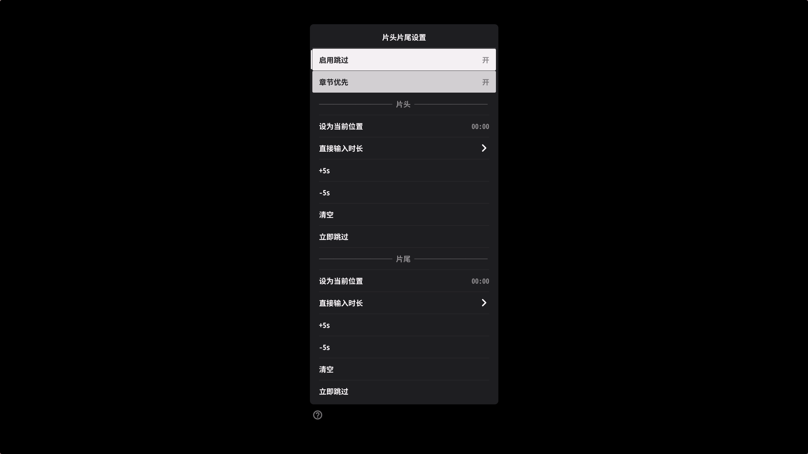

# MPV Skip Intro & Outro Plugin

这是一个为 mpv 播放器设计的 Lua 脚本，用于跳过番剧/电影的片头（OP）和片尾（ED）。

它支持两种模式：
1.  **自动识别（章节优先）**：自动读取视频内置的章节（Chapter）信息，匹配 `OP`、`ED`、`Intro`、`Outro` 以及中文的 `片头`、`片尾`、`序章` 等关键词，精准跳过。
2.  **手动设置**：对于没有章节信息的视频，可以通过菜单或快捷键手动设置片头/片尾时长。

## ✨ 特性

- **智能章节识别**：支持自定义正则表达式匹配章节标题。
- **uosc 集成**：完美适配 [uosc](https://github.com/tomasklaen/uosc) 界面，提供图形化菜单进行开关、微调和输入。
- **无缝交互**：支持在 uosc 菜单内直接输入数字设置时长，无需跳转原生 OSD。
- **快捷键微调**：支持通过快捷键快速设置当前位置为片头/片尾，或进行 ±5s 微调。
- **防误触逻辑**：
  - 仅在检测到的 OP/ED 区间内触发跳过，避免误跳过正片前的序章。
  - 手动调整时间后立即生效，无需重启脚本。

## 📦 安装

1.  将 [`scripts/skip_oped.lua`](scripts/skip_oped.lua) 复制到你的 mpv `scripts` 文件夹。
2.  将 [`script-opts/skip_oped.conf`](script-opts/skip_oped.conf) 复制到你的 mpv `script-opts` 文件夹（可选，用于自定义配置）。

## ⚙️ 配置 (script-opts/skip_oped.conf)

你可以在 `skip_oped.conf` 中自定义默认行为和匹配模式：

```ini
# 是否默认启用
enabled=yes

# 是否优先使用章节信息
prefer_chapters=yes

# 打开菜单时自动暂停播放
pause_on_menu=yes

# 默认手动时长
intro_len=0
outro_len=0

# 手动时长的最大限制（秒）
manual_limit_sec=300

# 快捷键微调步长（秒）
step_sec=5

# OSD 提示显示时长（秒）
osd_duration=2.0

# 章节匹配模式 (支持 Lua 正则, 逗号分隔)
opening_patterns=^op%s,^op$, opening$,^opening$,^intro%s,^intro$, intro$,片头,片頭,序章,主题曲,主題曲,开场,開場,序幕
ending_patterns=^ed%s,^ed$, ending$,^ending$,^outro%s,^outro$, outro$,片尾,片尾,尾声,尾聲,闭幕,閉幕,结束,結束,预告,預告
```

## ⌨️ 快捷键绑定

在 `input.conf` 中添加以下绑定（将 `<KEY>` 替换为你想要的按键）：

```properties
# === 基础功能 ===
<KEY>   script-binding skip_oped/menu            # 片头片尾设置菜单
<KEY>   script-binding skip_oped/toggle          # 启用/禁用跳过片头片尾

# === 设置当前位置 ===
<KEY>   script-binding skip_oped/intro_set_pos   # 设置当前位置为片头
<KEY>   script-binding skip_oped/outro_set_pos   # 设置当前位置为片尾

# === 时间微调 ===
<KEY>   script-binding skip_oped/intro_add       # 片头 +5s
<KEY>   script-binding skip_oped/intro_sub       # 片头 -5s
<KEY>   script-binding skip_oped/outro_add       # 片尾 +5s
<KEY>   script-binding skip_oped/outro_sub       # 片尾 -5s

# === 立即跳转 ===
<KEY>   script-binding skip_oped/intro_skip_now  # 立即跳过片头
<KEY>   script-binding skip_oped/outro_skip_now  # 立即跳过片尾

# === 直接输入时长 (需要 uosc) ===
<KEY>   script-binding skip_oped/intro_input     # 直接输入片头时长
<KEY>   script-binding skip_oped/outro_input     # 直接输入片尾时长
```

## 🧩 uosc 集成

如果你安装了 [uosc](https://github.com/tomasklaen/uosc)，可以通过以下方式控制：

### 1. uosc control 控制栏
在 `script-opts/uosc.conf` 的 `controls` 中添加 `skip_oped`，即可在播放时通过控制栏快速呼出菜单：

```ini
# 示例：在 controls 中加入 skip_oped
controls=menu,...,skip_oped,...
```

添加后，播放时控制栏会显示一个"片头片尾设置"按钮，点击可呼出完整菜单。

### 2. 菜单控制
按 `Alt+o`（或自定义快捷键）可以呼出可视化菜单：
- 启用/禁用全局跳过
- 开关"OP/ED 章节优先"
- 手动设置片头/片尾时长（支持直接输入数字）
- 清空设置 / 立即跳过



## ⚠️ 注意事项

- 如果你使用了 `input_plus.lua` 或其他类似的跳过脚本，建议禁用它们的相关功能（如 `chap_skip_toggle`），以免产生冲突。
- 自动模式依赖视频文件的 Chapter 信息，如果视频没有章节，脚本会自动回退到手动时长模式。

## 📝 更新日志

### 2026-02-16 (v2)
- **Bug 修复**：修复播放列表场景下片头跳过失效的问题
  - 问题场景：在播放列表中手动设置片头/片尾后，后续集数的片头不会自动跳过
  - 修复原因：
    1. `start-file` 事件中清空 `detected` 状态，避免使用上一集残留的章节检测值
    2. `reset_skip_state()` 现在也会重置 `first_time_pos`，确保设置新时长后重新检查
    3. 菜单输入时长后调用 `reset_skip_state()` 重置跳过状态
    4. `apply_auto_skip()` 首次触发时正确处理播放位置已在片头之后的情况
- **UI 优化**：
  - 主菜单禁用搜索功能 (`search_style = 'disabled'`)，避免误触数字键触发搜索
  - 删除一级菜单"直接输入时长"项的格式提示，仅保留二级菜单中的格式说明

### 2026-02-16 (v1)
- **Bug 修复**：修复播放列表场景下片头跳过失效的问题
  - 问题描述：在播放列表中手动设置片头/片尾后，后续集数的片头不会自动跳过
  - 修复原因：新增 `first_time_pos` 状态标记，在新文件首次触发 `time-pos` 时不再盲目将 `skipped_intro` 设为 `true`
- **代码优化**：精简开头注释，参考 stats.lua 格式

## 📝 License

MIT
